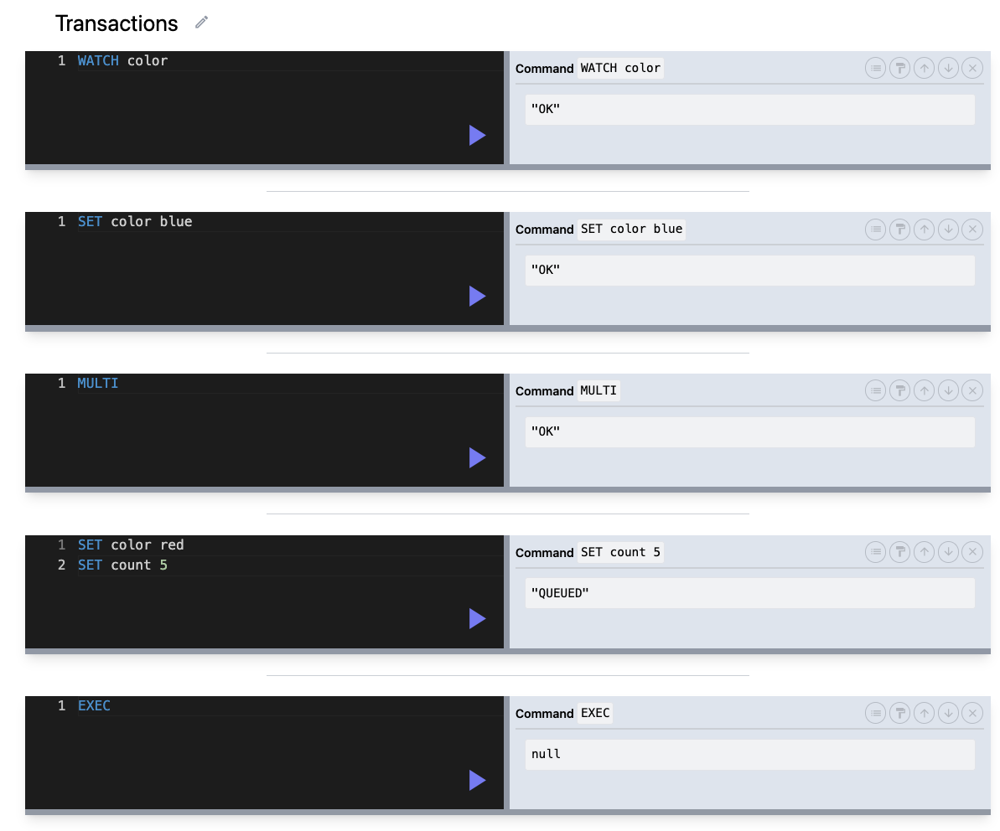
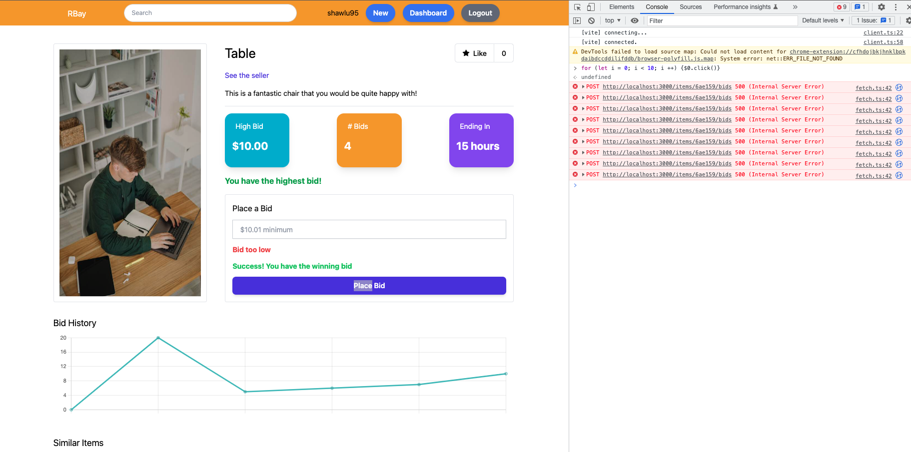

## Concurrency

- use atomic update command without reading; e.g. `HINCRBY`, `HSETNX`
- use `watch` a key with transaction; if the key changed, all concurrent transactions fail
  - a new connection is created for the transaction, and closed once transaction is completed
  - watch the key before retrieving it from Redis
- use lock
- write LUA script

