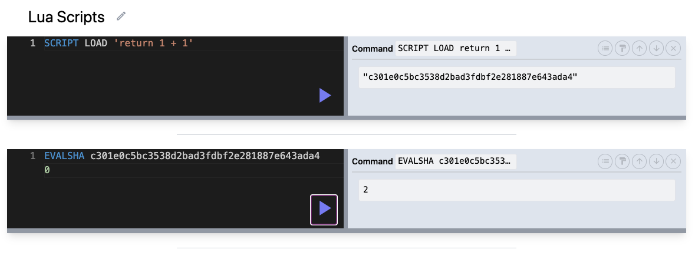
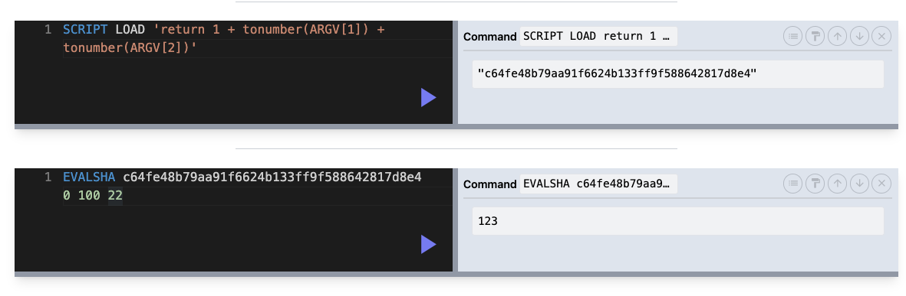
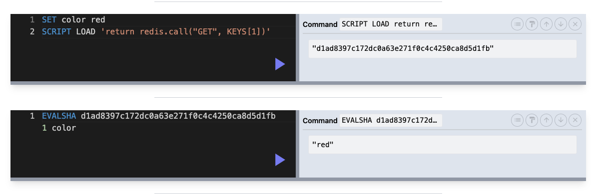

## LUA Scripting Language

- online learning tool: https://www.tutorialspoint.com/execute_lua_online.php

```lua
print("Hello World!")
print(123)
print('hell')

-- default is global variable
local sum = 1 + 1
sum = 5
print(sum)

if sum > 0 then
    print('sum is positive')
end

if sum ~= 0 then
    print('sum is nonzero')
end

if sum == 5 then
    print('sum is five')
end

-- 0 is a truthy value, so is empty string
if 0 and '' then
    print('0 and empty string are truthy')
end

if false or not true then
    print('never executed')
end

-- nil is equivalent to null and undefined, falsy
if nil then
    print('won"t run')
end

-- array is 1-index
local colors = {'r', 'g', 'b'}
print(colors[1])
print(#colors) -- length of array
table.insert(colors, 'orange')
print(colors[4])

for i, v in ipairs(colors) do
    print(i, v)
end

-- index is inclusive on bounds
for i = 5, 10 do
    print(i)
end

local user = {id = 'a1', name = 'alice'}
print(user['id'])
for k, v in pairs(user) do
    print(k, v)
end
```




### Redis in Lua

- all Redis key must be provided to the script as `KEYS` array
- cannot dynamically generate key (must be known in advance)
- the first param marks the length of the `KEYS` array
- difficult to debug and test
- minimize number of roundtrips to Redis


