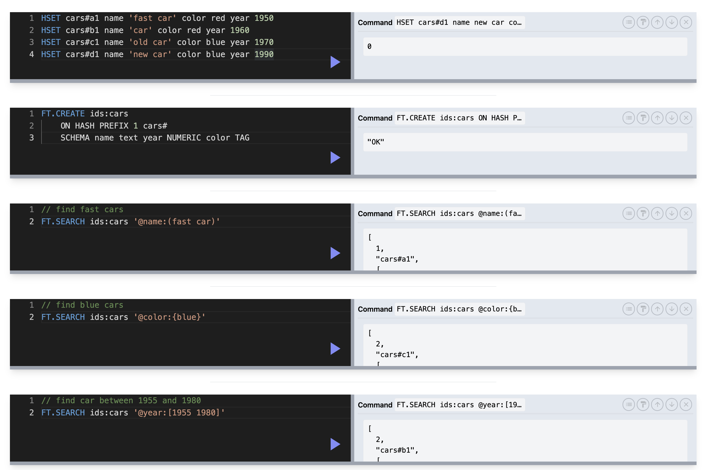

## Redis Search

- difficult to configure on M1 mac
- use **Redis Stack** which includes RediSearch, RedisJSON, RedisGraph, RedisTimeSeries, RedisBloom

### `FT.CREATE` build index

- create an index on all key with specific pattern (collection) e.g. `item#`
- index field such as color, year, price
- when app first connect to index, get a list of index that already exist, create if not exist

```javascript
// get all existing indices
FT._LIST;
```

- Some fields can be sortable: `name`, `endingAt`, `views`, `likes`, `price`, `bids`
- Some fields are not sortable: `description`, `ownerId`

---

### `FT.SEARCH` run query

- query: matching exact requirement, string `()`, tag `{}`, range `[]`
- search: not exact fit, close enough `like`
- documentation: redis.io/commands/ft.search
- index types:
  - numeric: `@year:[1955 1960]`
  - geo: geographic
  - vector: similarity queries, very advanced
  - tag: enum or id, only support exact string lookup `@color:{red}`
  - text: free-form text, fuzzy search, fancy ops `@name:(shaw)`
- stop words are automatically filtered out



#### Tags and Numeric Query

```javascript
HSET cars#a1 name 'fast car' color red year 1950
HSET cars#b1 name 'car' color red year 1960
HSET cars#c1 name 'old car' color blue year 1970
HSET cars#d1 name 'new car' color blue year 1990

FT.CREATE ids:cars
    ON HASH PREFIX 1 cars#
    SCHEMA name text year NUMERIC color TAG

// find fast cars
FT.SEARCH ids:cars '@name:(fast car)'

// find blue cars
FT.SEARCH ids:cars '@color:{blue}'

// find blue and red car between 1955 and 1980
FT.SEARCH ids:cars '@year:[1955 1980] @color:{blue|red}'

// find NON-blue car NOT between 1955 and 1980
FT.SEARCH ids:cars '-@year:[1955 1980] -@color:{blue}'
```

#### Text Query

- auto-preprocessing: remove stop words, spaces, punctuation
- auto-stemming: reduce words to base form, e.g. `fastly` to `fast` (see https://snowballstem.org/demo.html)

```javascript
// search all text fields for fast
FT.SEARCH ids:cars fast

// name contains fast AND car
FT.SEARCH ids:cars '@name:(fast car)'

// name contains fast OR car
FT.SEARCH ids:cars '@name:(fast | car)'

// name MUST NOT contains fast
FT.SEARCH ids:cars '-@name:(fast)'
```

#### Fuzzy Search

- up to three character mismatch

```javascript
// not wildcard, allow for one-char mismatch
FT.SEARCH ids:cars '@name:(%dar%)'

// not wildcard, allow for two-char mismatch
FT.SEARCH ids:cars '@name:(%%rar%%)'

// not wildcard, allow for three-char mismatch
FT.SEARCH ids:cars '@name:(%%%ttt%%%)'
```

#### Prefix Search

- two character minimum, can't do `a*`

```javascript
// all name starting with fa
FT.SEARCH ids:cars '@name:(fa*)'

```

#### Weighted Search

- search terms are scored by tf-idf
- terms can be assigned weights
- fields can be assigned weights (higher weight on title, lower in description)
- use `FT.EXPLAINCLI` to understand query in boolean algebra, without executing the query
  = use `FT.PROFILE` to check # retrieved and time spent, after executing the query

```javascript
// 5 times weight on name
@name:(chair)=>{$weight:5.0} @description:(chair)

// retrieve either match in name OR description
(@name:(chair)=>{$weight:5.0}) | (@description:(chair))

// debug query without executing
FT.EXPLAINCLI idx:i '(@name:(%natural%) => { $weight: 5.0 }) | @description:(%natural%)'

// check query performance
FT.PROFILE idx:i SEARCH QUERY '%chairs%' LIMIT 0 0
```

---

### Pre-processing Query Criteria

- show auto-complete to user using prefix search
- fuzzy search when query is entered
- transform user query into redis search query, split space, joining with AND, OR etc
- adding mismatch allowance to complex term
- lots of domain knowledge required

---

### `FT.DROPINDEX` delete index

```javascript
FT.DROPINDEX idx:i
```
