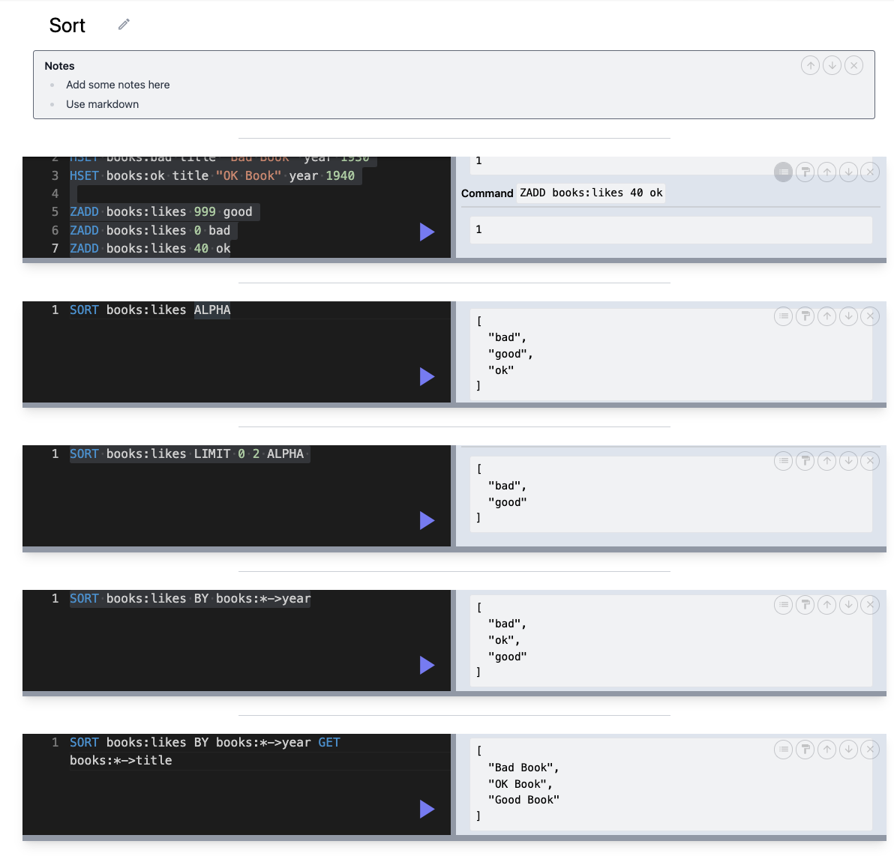

## Sort

- apply to sets, sorted sets, lists
- most often, not used for sorting
- can join data from multiple sources
- `Sort` refers to member of sorted set as "score", not the score in sorted set

```
HSET books:good title "Good Book" year 1950
HSET books:bad title "Bad Book" year 1930
HSET books:ok title "OK Book" year 1940

ZADD books:likes 999 good
ZADD books:likes 0 bad
ZADD books:likes 40 ok

SORT books:likes ALPHA
SORT books:likes LIMIT 0 2 ALPHA

SORT books:likes BY books:*->year
```

### sort by year, return id

`SORT books:likes BY books:*->year`

- get all member of books
- use wildcard `.*` to get all hash and retrieve year
  - `books:good->year`, `books:ok->year`, `books:bad->year`
- return the members only (not year)

### joining data

```
SORT books:likes BY books:*->year
  GET #
  GET books:*->title
  GET books:*->year
```

- to break command into multiple lines, a tab is required
- sort by year
- return the **id**, title, year



### joining data without sort

```
SORT books:likes BY nosort
  GET #
  GET books:*->title
  GET books:*->year
```
