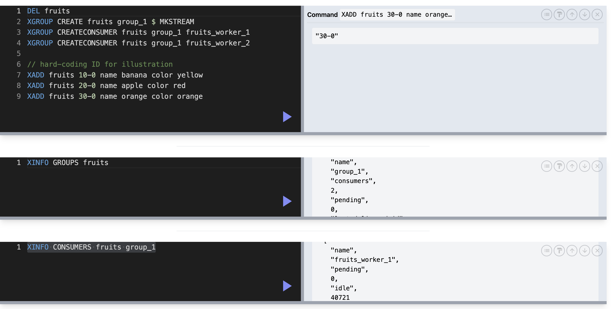
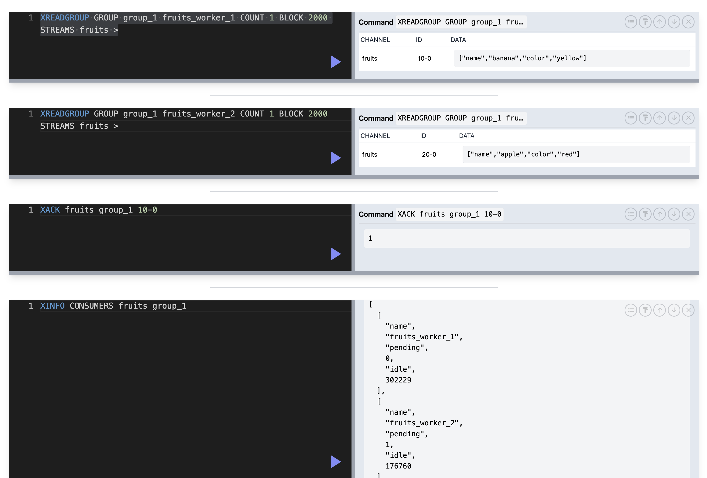
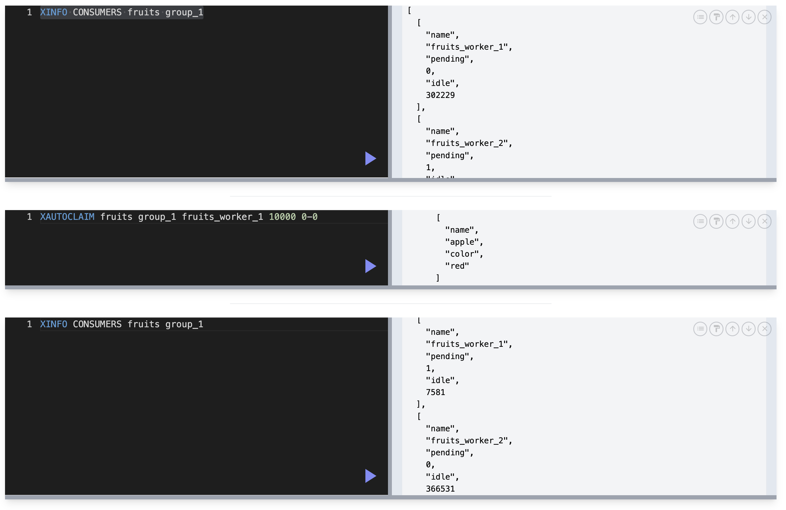

## Streams

- similar to list and sorted set
- communication between servers
- most useful with consumer groups
  - not all consumers are sent to all consumers
  - each consumer can take up a portion of messages
  - a consumer group as a whole will process each message once
  - each consumer will ask for the next message
  - each consumer will ack message afte receiving
- message is a regular redis hash, id is `unixtimestamp-0`
- consumers are decoupled from producers

### Command

- `XADD` add message to stream

#### XREAD

- `XREAD STREAMS fruits 0-0` read all message
- `XREAD COUNT 1 STREAMS fruits 1674605649440-0` retrieve one element, exclusive, after 1674605649440
- `XREAD BLOCK 3000 STREAMS fruits 1674605649440-0` read and wait for 3 seconds if no data are available, avoid sending tons of identical read request
- `XREAD COUNT 5 BLOCK 3000 STREAMS fruits 1674605649440-0`: will wait if no element, return as soon as one element became available
- `XREAD COUNT 5 BLOCK 3000 STREAMS fruits $`: look for message starting at current time, use for the first message!
- all follow-up read request will use most recent message's id as offset

#### XRANGE

- `XRANGE`: `XRANGE fruits 1674605649441-0 1674605982293-0 COUNT 100` inclusive both ends
- `XRANGE fruits (1674605649441-0 (1674605982293-0 COUNT 100` exclusive both ends
- `XRANGE fruits 1674605649441-0 + COUNT 100` all messages >= 1674605649441
- `XRANGE fruits - 1674605649441-0 COUNT 100` all messages <= 1674605649441

#### XGROUP

- `XGROUP CREATE fruits group_1 $ MKSTREAM`
  - create consumer group `group_1` for stream `fruits`
  - start consuming message starting from now
  - create stream if not exists
- `XGROUP CREATECONSUMER fruits group_1 fruits_worker_1`
  - add a worker named `fruits_worker_1`
- `XINFO GROUPS fruits` check groups of stream `fruits`
- `XINFO CONSUMERS fruits group_1` check workers of group `group_1`
- `XREADGROUP GROUP group_1 fruits_worker_1 COUNT 1 BLOCK 2000 STREAMS fruits >`
  - name of group `group_1`
  - name of worker `fruits_worker_1`
  - read at most 1 message
  - wait for 2 seconds if not found
  - `>` give any message that has not been delivered and processed

- `XACK fruits group_1 10-0`: worker `group_1` acks message id `10-0`

- `AUTOCLAIM fruits group_1 fruits_worker_2 10000 0-0`
  - get message that hasn't been acked 10s after delivery
  - starting on id `0-0`

